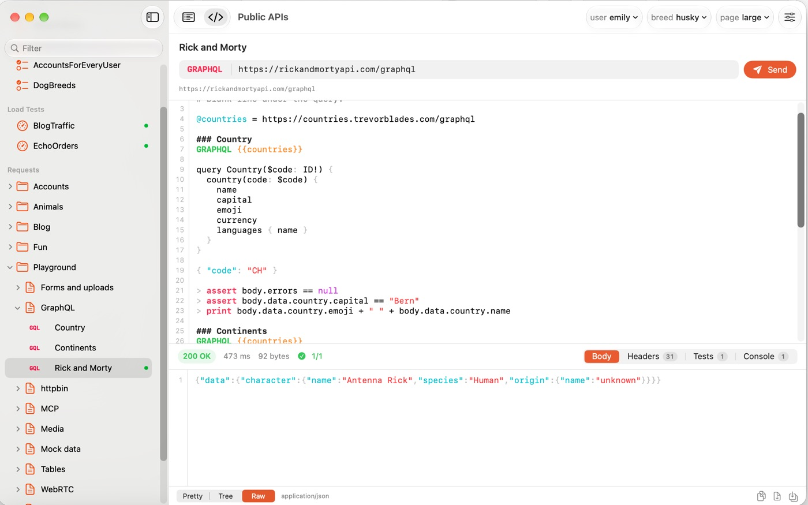
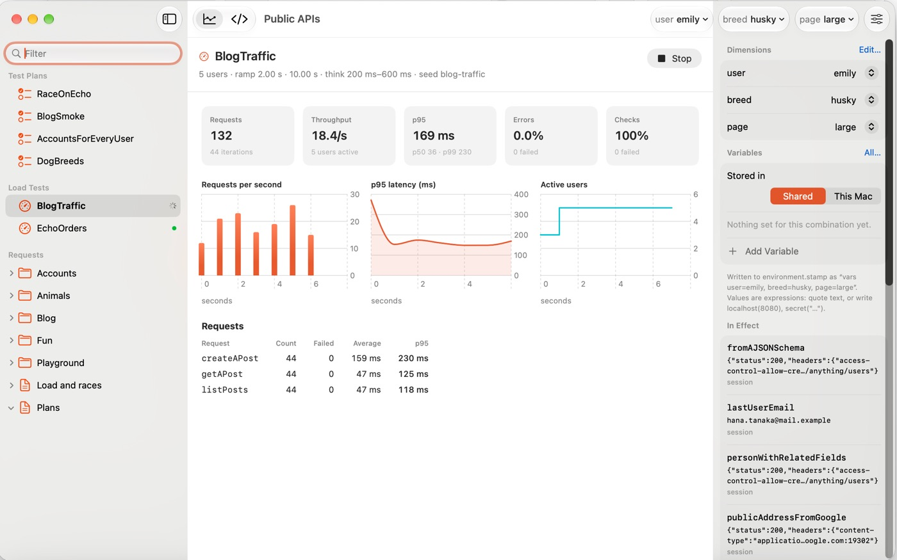
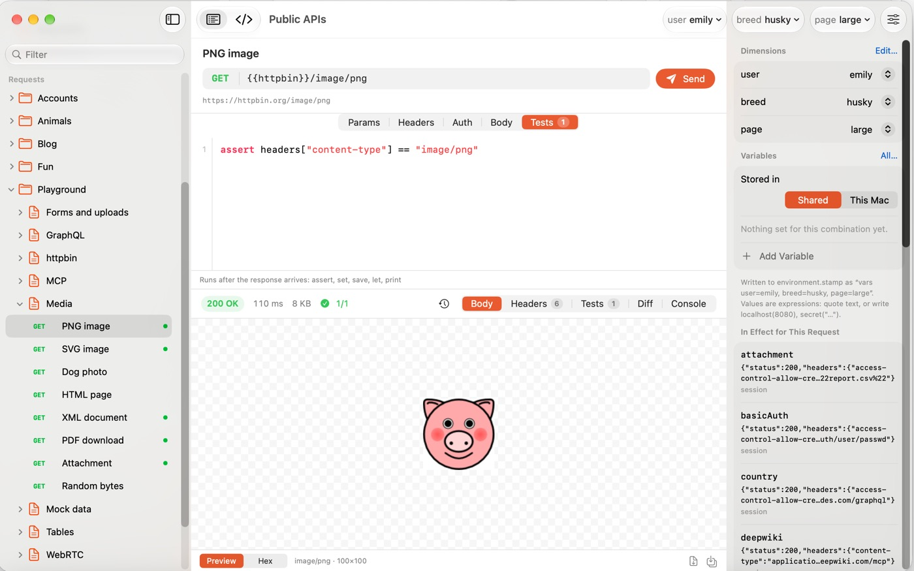

<div align="center">

# Stampdrill

**Your API work as plain text in git.**

One `.stamp` file holds the request, the assertions, the test plan, the load test and the race test.
It diffs in a pull request, merges like code, and runs the same way for a person, for CI, and for an agent.

[](https://github.com/stampdrill/stampdrill/releases/latest)
[](https://github.com/stampdrill/stampdrill/actions/workflows/ci.yml)
[](LICENSE)
[](https://github.com/stampdrill/homebrew-tap)
[](#install)

### [Quick start: nothing to a passing test in five minutes →](https://stampdrill.com/quick-start/)

[Install](#install) · [Guide](https://stampdrill.com/guide/) · [Try it in 60 seconds](#try-it-in-60-seconds) · [Why](#why-not-just-use-curl-or-postman) · [Language](https://stampdrill.com/language/) · [Mac app](https://stampdrill.com)

</div>

```console
$ stamp test api

▶ BlogSmoke  Plans.stamp
  ✓ page=small  824 ms
  ✓ page=large  707 ms
✓ 2 iterations, 12 requests, 34 checks, 1.53 s

▶ AccountsForEveryUser  Plans.stamp
  ✓ user=michael  1.01 s
  ✓ user=emily  1.01 s
  ✓ user=sophia  1.01 s
✓ 3 iterations, 12 requests, 30 checks, 1.01 s

✓ all 4 plans passed
```

## Install

```bash
brew install stampdrill/tap/stampdrill
```

Static binaries for macOS and Linux are on the [releases page](https://github.com/stampdrill/stampdrill/releases),
and need nothing else installed.

The command is **`stamp`**. `stampdrill` is installed as well and is the same program, so either works; the
tool answers to the name you called it by, including in its own help and error messages:

```console
$ stamp test api --tags smoke
$ stamp mcp .
```

## Try it in 60 seconds

Point it at a Postman collection you already have:

```bash
stamp import collection.json environment.json -o api
stamp check api
stamp run api/orders.stamp
```

You now have a folder of text files. Open one:

```
### Log in
POST {{baseUrl}}/login
Content-Type: application/json

{ "username": "{{username}}", "password": "{{password}}" }

> assert status == 200
> set token = body.token

### My orders
@needs logIn
@auth bearer {{token}}
GET {{baseUrl}}/orders?limit=20

> assert all(body.items, order => order.total > 0)
```

That file is the whole thing: the request, the credentials handling, the dependency on logging in first,
and the checks. Commit it. Run it in CI:

```yaml
- run: |
    curl -sL https://github.com/stampdrill/stampdrill/releases/latest/download/stampdrill-linux-x86_64.tar.gz | tar xz
    ./stamp test api --junit reports/junit.xml
```

## Why not just use curl, or Postman?

**curl and httpie** are fine for one request. They have nowhere to put the assertion, the login that has to
happen first, the five environments, or the twenty users hitting the endpoint at once.

**Postman, Insomnia and friends** keep your collection in a database or a cloud workspace. You cannot review
a change to a request in a pull request, you cannot keep a token out of a shared file by accident, and running
the same checks in CI means paying per seat.

**Bruno** had the same idea about files, and it is good at it. The difference is what the files hold. Bruno
stores requests; here one file also carries the multi step plan, the load test with thresholds that gate your
pipeline, the race condition test, the MCP checks, and sample data that stays consistent across services. The
command line tool is the whole engine rather than a runner for a collection, so the app, your shell, your CI
and an agent all execute exactly the same thing.

**Stampdrill keeps everything in files you own.** No account, no sync service, no workspace in someone else's
cloud. Nothing leaves your machine except the requests you send. The engine and the command line tool are
open source, so if this project disappears tomorrow your files still run.

## What it covers

Everything below runs from the command line tool in this repository. No app required.

| | |
|---|---|
| Requests | HTTP and REST, GraphQL, WebSockets, STUN and TURN, and Model Context Protocol servers over HTTP or stdio |
| Checks | Assertions on status, headers, JSON bodies and timing, with values passed between requests |
| Test plans | Steps, loops, conditions, retries, timeouts, over a matrix of environments and CSV or JSON data |
| Load tests | Virtual users, ramp up, think time, thresholds on p95, error rate and throughput |
| Race conditions | Actors started on the same instant, to catch double spends and lost updates |
| Environments | As many dimensions as your system has: stage, region, tenant, user. Not a flat list of environments |
| Secrets | `secret(...)` values are masked in output and kept in a local file that stays out of git |
| Importing | Postman, Insomnia, Bruno, HAR, curl and OpenAPI, with environments and credentials carried over |
| Reports | JUnit, HTML and JSON, with exit codes so pipelines fail when they should |

### Load tests

A `load` block lives in the same file as the requests it drives:

```
load BlogTraffic {
  users 5
  ramp 2s
  duration 10s
  think 200ms-600ms
  seed blog-traffic
  threshold p95 < 1500ms
  threshold errors < 5%
  scenario {
    run listPosts
    run createAPost
    run getAPost
  }
}
```

```console
$ stamp load api

▶ BlogTraffic  Load and races.stamp · 5 users · 10.00 s
  requests  183 in 10.64 s, 17.2/s, 0 failed (0.0%)
  latency   p50 155 ms  p90 171 ms  p95 205 ms  p99 239 ms  max 250 ms
  checks    488 passed, 0 failed · 61 iterations
    createAPost            ×61  avg 168 ms  p95 229 ms
    getAPost               ×61  avg 134 ms  p95 192 ms
    listPosts              ×61  avg 50 ms  p95 116 ms
  ✓ threshold p95 < 1500ms  (205 ms)
  ✓ threshold errors < 5%  (0.00%)
  ✓ threshold checks > 95%  (100.00%)
✓ passed
```

Thresholds decide the exit code, so a load test fails a pipeline the same way a unit test does.

### Race conditions

`concurrently` starts actors together and `sync` lines them up on the same instant, which is how you catch a
coupon redeemed twice or a balance updated from two sides:

```
plan RaceOnEcho {
  concurrently 5 {
    sync "go"
    run placeOrder with orderId = uuid("shared-cart")
    share lastActor = actor
  }

  expect length(results) == 5
  expect all(results, r => r.status == 200)
  expect length(unique(map(results, r => r.body.json.orderId))) == 1, "every actor used the same cart id"
}
```

```console
$ stamp test api --tags race

▶ RaceOnEcho  Load and races.stamp
  ✓ run  616 ms
✓ 1 iteration, 5 requests, 4 checks, 616 ms
```

### Test plans across environments

A plan runs over a matrix, so one file covers every combination you care about:

```console
$ stamp test api

▶ AccountsForEveryUser  Plans.stamp
  ✓ user=michael  1.01 s
  ✓ user=emily  1.01 s
  ✓ user=sophia  1.01 s
✓ 3 iterations, 12 requests, 30 checks, 1.01 s
```

```bash
stamp test api --junit reports/junit.xml   # for CI
stamp test api --stamp-xml reports/api.xml # one file: parse it, or open it in a browser
stamp test api --html reports/report.html  # to read
stamp env api environment=qa region=eu     # what those dimensions resolve to
```

### The same fake person across services

`person(key)` returns a consistent identity for a key: the same name, email and address everywhere it appears,
in any request, against any API. Set `@seed` and the whole run repeats exactly, which is what makes a failure
reproducible instead of a story about something that happened once.

```
@seed shop-demo

### Create the customer
POST {{crm}}/customers
Content-Type: application/json

{ "name": "{{person("cust-42").name}}", "email": "{{person("cust-42").email}}", "city": "{{person("cust-42").address.city}}" }

### Bill the same person in another service
POST {{billing}}/invoices
Content-Type: application/json

{ "customer": "{{person("cust-42").name}}", "email": "{{person("cust-42").email}}", "amount": {{fake.price}} }

> assert body.json.customer == person("cust-42").name
```

```console
$ stamp run seed.stamp

  │ created Maya Nguyen <maya.nguyen@inbox.example> in Toronto
  │ billed Maya Nguyen <maya.nguyen@inbox.example>
✓ 2 requests, 2 assertions
```

Run it again tomorrow and it is still Maya Nguyen in Toronto. Change the seed and you get a different, equally
consistent person. `mock(readJson("./schema.json"), "key")` builds a whole body from a JSON Schema the same way.

### Testing an MCP server

`MCP` is a request method like any other, over Streamable HTTP or stdio. After the handshake a script has the
server's tools, resources, prompts and notifications, and can call them:

```
MCP stdio: node build/index.js

> assert toolNames contains "search"
> let found = call("search", { query: "stampdrill" })
> assert !found.isError
> assert read("docs://readme").text != ""
```

`@sampling`, `@elicitation` and `@roots` answer the requests a server sends back to the client, so a server
that asks for a model completion can be tested without a model.

## For AI agents

A `.stamp` file is plain text, so an agent can write one, and `stamp check` gives it a way to find out
whether it got it right. That loop is the point: the agent writes the request, runs the check, fixes what it
broke, with no GUI and no cloud workspace in the way.

Give it a spec and ask for a load test. This is a real session, start to finish:

```console
$ stamp import openapi.yaml -o api
  created api/Shop API.stamp
Imported Shop API (OpenAPI document): 3 requests in 1 file
```

Then ask the agent for the part a spec cannot describe: "add a smoke plan and a load test for the product
pages, with thresholds". It writes into the same file, and `check` tells it immediately when it got the syntax
wrong:

```console
$ stamp check api
Shop API.stamp:10:3: error: 'think' needs a duration or a range such as 200ms..1s
    think 100ms-400ms
    ^^^^^^^^^^^^^^^^^
✗ 1 file, 3 requests, 1 error

$ stamp check api
✓ 1 file, 3 requests
```

```console
$ stamp load api

  requests  220 in 10.48 s, 21.0/s, 7 failed (3.2%)
  latency   p50 126 ms  p90 176 ms  p95 206 ms  p99 230 ms  max 295 ms
  ✓ threshold p95 < 1500ms  (206 ms)
  ✗ threshold errors < 1%  (3.18%)
    ×7 listProducts: HTTP 429
✗ failed
```

That failure is real: the API rate limited us at five concurrent users. Nobody wrote that test by hand, and it
found something on the first run.

### Stampdrill is also an MCP server

`stamp mcp` serves a workspace to an agent over stdio, so Claude, Cursor or anything else that speaks the
protocol can run what it wrote without shelling out:

```json
{
  "mcpServers": {
    "stampdrill": { "command": "stamp", "args": ["mcp", "/path/to/your/workspace"] }
  }
}
```

Six tools: `list_requests`, `check`, `run_request`, `run_plan`, `run_load` and `show_environment`. The agent
still writes `.stamp` files with its ordinary file tools, so what it produces stays in your repository and in
your diff. The server only runs them and reports back.

### The skill

The [`stamp-files` skill](plugins/stampdrill) teaches an agent the conventions, including keeping secrets out
of shared files and checking its work before calling it done. In Claude Code:

```
/plugin marketplace add stampdrill/stampdrill
/plugin install stampdrill@stampdrill
```

Agents that read the [Agent Skills](https://agentskills.io) format can use
[`SKILL.md`](plugins/stampdrill/skills/stamp-files/SKILL.md) directly.

## The Mac app

**Not in this repository.** The command line tool above runs everything; the
[Mac app](https://apps.apple.com/app/id6812025161?mt=12) is a separate, paid, closed source product on the Mac
App Store that reads the same files. It is where you read what came back:
bodies as text, tree or table, images and PDFs previewed, a diff of one run against an earlier one, load tests
charted live, and an inspector for MCP servers.







## What is in this repository

| | |
|---|---|
| [`Sources/Stamp`](Sources/Stamp) | The `.stamp` language: parser, expressions, templates, sample data |
| [`Sources/StampdrillCore`](Sources/StampdrillCore) | Workspaces, environments, runners, plans, load tests, transports, importers |
| [`Sources/StampdrillCLI`](Sources/StampdrillCLI) | The `stampdrill` command |
| [`docs/stamp.md`](docs/stamp.md) | The language reference |
| [`Examples/`](Examples) | A workspace against public test APIs: requests, dimensions, plans, load tests, WebSockets, GraphQL, MCP |
| [`plugins/stampdrill`](plugins/stampdrill) | The agent skill |
| [`editors/vscode`](editors/vscode) | Syntax highlighting, also on the [Marketplace](https://marketplace.visualstudio.com/items?itemName=StampDrill.stampdrill) |

## Build it

Swift 6.1 or later, macOS or Linux:

```bash
git clone https://github.com/stampdrill/stampdrill.git
cd stampdrill
swift build
swift test
swift run stamp check "Examples/Public APIs"
```

That builds the `stamp` command and the two libraries behind it. The Mac app is not part of this
repository; `StampdrillCore` is the engine it uses, and MPL lets you build your own interface on top of it.

## License

| | |
|---|---|
| `Sources/`, `Tests/`, `Package.swift` | [Mozilla Public License 2.0](LICENSE) |
| `report/` | [Mozilla Public License 2.0](LICENSE) |
| `docs/`, `Examples/`, `plugins/`, `editors/` | [MIT](LICENSE-MIT) |

MPL is file level copyleft: you may use the engine in a closed product, including commercially, and only
changes you make to its files have to be published.

The Stampdrill name and icon belong to Samal Studios. The Mac app is a separate, proprietary product.
See [CONTRIBUTING.md](CONTRIBUTING.md) to send a change, and [SECURITY.md](SECURITY.md) to report a vulnerability.
